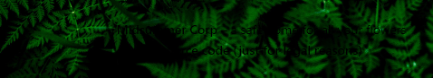
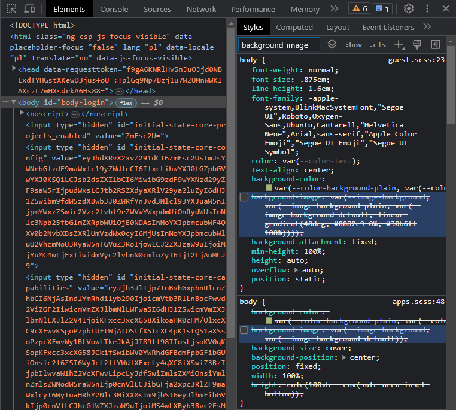
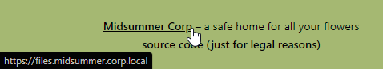

[🢁](../README.md) &nbsp;
[🢀](../1%20Fern%20Flower/README.md) &nbsp;Task 2&nbsp;
[🢂](../3%20Puck/README.md)

# Midsummer Corp

>Welcome to Midsummer Corp, dedicated to the pursuit of knowledge and discovery of the elusive fern flower. Our mission is to uncover the secrets of this mystical plant. 
>
>We are driven by a passion for uncovering the unknown and discovering the beauty of the natural world. Our team of dedicated researchers and explorers have scoured the earth in search of the fern flower, and we are committed to continuing this quest until we succeed. 
>
>At our core, we value curiosity, perseverance, and collaboration. We believe that by working together, we can achieve the impossible and unlock the mysteries of the fern flower. We are committed to sharing our findings with the scientific community and the wider world so that others may benefit from our knowledge and insights. 
>
>We hold ourselves to the highest standards of integrity and ethics, and we are committed to conducting our research in a responsible and sustainable manner. We believe that our work has the power to inspire others to explore the wonders of the natural world, and we are honored to be stewards of this mission. 
>
>Join us on our journey of discovery and be a part of uncovering the secrets of the fern flower. 

# Description
In this room, every task will allow you to gain access to a new Midsummer Corp employee. On every account you can also find a piece of the final puzzle `fernflower_flag[1-6].png`, which you will need to complete the last quest.

The application is based on the NextCloud server (GitHub - nextcloud/server). The software and the configuration have been intentionally made vulnerable. 

The web application will be available at: `http://MACHINE_IP/`

# Tasks

## What is the application's base URL?

Answer format: `*****.*********.****.*****`

Answer: `files.midsummer.corp.local`

To obtain application's URL we have to open home page and look at the bottom

It can be hard to notice. In developer tools search for `background-image` and disable both checkboxes to hide background image.

Now the URL is clearly visible under one of the links

By the way, we learn about the included source code. This will come in handy in later tasks.