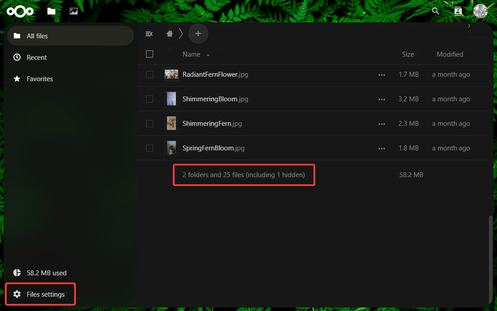
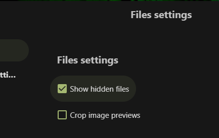

[🢁](../README.md) &nbsp;
[🢀](../2%20Midsummer%20Corp/README.md) &nbsp;Task 3&nbsp;
[🢂](../4%20Leshy/README.md)

# Puck

**☆ Puck (Intern) ☆**

> Responsible for creating chaos and confusion to distract people from the company's true intentions. 

# Description

Authentication is the process of verifying the identity of a user or a system, typically for the purpose of granting access to a particular resource or service. It involves verifying that a claimed identity is genuine and accurate and ensuring that a user or a system has the appropriate credentials to access the requested resource. While password authentication is the best-known authentication factor, there are others. They are typically classified as: 

Something you know (a password or a PIN) 
Something you have (a smartphone or a U2F security key) 
Something you are (the way your veins are laid out on your palm, iris and retina characteristics) 
When implementing an authentication process, many mistakes can be made. Also, relying on a single factor can be risky. In such a case, if someone knows your password... no vulnerability is needed to impersonate a victim. 

Puck hasn't been very careful, and his credentials could be buried somewhere in the application. 


# Tasks

**Prerequisites**: None. 

**Your objective**: Find a way to log in to the puck account. Password brute-force is not required. 

## 1. What do we call the process of verifying the identity of a user or system?

Answer format: `**************`

Answer: `authentication`

Answer included in description

## 2. How do we call the process of verifying that a user has access to a particular resource?

Answer format: `*************`

Answer: `authorization`

Pretty straightforward to come up with if you had any contact with user validation. Alternatively, question can be searched in internet and one of the first result has anwser in page title.

## 3. How long is Puck's password?

Answer format: `**`

Answer: `16`

From description we know, that credentials could be buried somewhere in the application. Opening source view and searching for a password reveals, that oc_appconfig object has some information about default password:

```js
var oc_appconfig = {..., "defaultPassword":"sfLfSNYavTD4PL4Z", ...}
```

Length of this password is an answer

## 4. What is the content of the file Fern_flower_ritual_shard1.txt in Puck's account?

Answer format: `**************{******************************************}`

Answer: `Midsummer_Corp{W@it_unt!1_m1dn1ght_0n_th3_Summ3r_Solst1c3}`

Using username `puck` and password from previous question `sfLfSNYavTD4PL4Z` lets us login into Pucks's account on Nextcloud server. Among the files is `Fern_flower_ritual_shard1.txt` with answer inside. We must also remember to download `fernflower_flag1.png` mentioned in [second task description](../2%20Midsummer%20Corp/README.md)

## 5. Who is going on vacation? Please provide their email address.

Answer format: `***************.****.*****`

Answer: `leshy@midsummer.corp.local`

Looking through the file more closely we find many fern pictures, and research directory with more information about story, but email address seems to be nowhere to be found. Finally noticing text at the bottom informs us about hidden file. In order to show him we need to enter settings...



...and check `Show hidden files`



After showing hidden files `.mail` directory appears with [inbox.mbox](./inbox.mbox) file inside. This file contains a few emails from other users to Puck. How can we know who is going on vacation? One of the mails says: `I am planning to take some time off from work and will be going on vacation starting next week`. This is an email from Leshy, so we can copy his email address from sender field. Another way to solve this is to look at the answer format. After opening file we know, that email format is `<username>@midsummer.corp.local`. Answer format is `***************.****.*****`, which leaves us with 5 characters for username. Leshy is the only one with 5 letter username, so we don't even have to read emails.