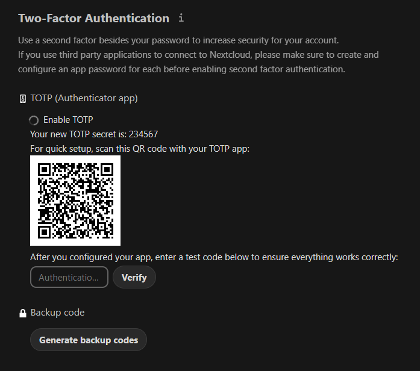

[🢁](../README.md)  
[🢀](../3%20Puck/README.md)  Task 4 
[🢂](../5%20Baba%20Yaga/README.md)

# Leshy

**☆ Leshy (Forest Tracker) ☆**

> Leshy is a forest spirit who has an intimate knowledge of the forest and its inhabitants. His job is to lead the team to the locations where the fern flower grows and to keep a watchful eye on any unwanted visitors who may threaten their mission.


# Description

As a member of Midsummer Corp with exceptional skills in tracking the fern flower, Leshy's account is protected by another layer of defense – multi-factor authentication. To get access to valuable information about the possible location of the fern flower and ways to track it, you will have to bypass this security measure. 

**How does MFA work?**

Multi-factor authentication (MFA) is a security measure that uses multiple forms of authentication to verify a user's identity. The idea behind MFA is to increase the security of online accounts and prevent unauthorized access. Even if an attacker manages to obtain a user's password, they will not be able to gain access without also possessing the other required authentication factors. 

**Common MFA issues**

MFA is more secure than single-factor authentication and for good reason. However, like any additional feature, it increases the attack surface and can introduce new vulnerabilities into the system. 

Sometimes the problem lies in the logic of the process itself. For example, after logging in with a login and password, a user may be redirected to a page that asks for their MFA code, but the valid session has already been issued. In this case, the user can simply go to another page without providing the MFA code and be fully logged in. 

Another issue to consider is the security of the MFA codes themselves. It is crucial that MFA codes are not easily guessable and can resist brute force attacks. They should be randomly generated and unique to each user. 

When an application requires MFA codes for different operations (for example, to log in and to confirm a wire transfer), the codes should be bound to each operation. It should not be possible to use the code provided to confirm a wire transfer to log in to the account. 

**Useful resources**

[Multifactor Authentication - OWASP Cheat Sheet Series](https://cheatsheetseries.owasp.org/cheatsheets/Multifactor_Authentication_Cheat_Sheet.html)


# Tasks

**Prerequisites**: Access to any account. 

**Your objective**: Find a way to log in to the leshy account. MFA code brute-force is not required. 

## 1. What is the length of the MFA code used in the application? Enter a numeric value in your answer.

Answer format: `*`

Answer: `6`

If you use 2FA authentication you should already know what length do most codes have. If not, you will see after adding 2FA authentication in the next step.

## 2. What is the content of the file Fern_flower_ritual_shard2.txt in Leshy's account?

Answer format: `Answer format: **************{****************************}`

Answer: `Midsummer_Corp{Fo11ow_Th3_Wi1l_o'_7h3_W1sps}`

To access Leshy's account we need to obtain his password and 2FA code. 

### 2FA code

Prerequisity of access to any account might suggest, that we need to do something there. Let's login on Puck's account and open security settings. In Two-Factor Authentication section, after clicking enable, QR code and suspiciously easy TOTP secret show up.



Scanning QR code reveals text that it's hiding: 

```otpauth://totp/Midsummer Corp:puck@http://MACHINE_IP?secret=234567&issuer=Midsummer Corp```

My first idea was to swap username from puck to leshy and scan it with authenticator app to have access to authentication codes. Actual solution is even easier, because `Midsummer Corp:puck@http://MACHINE_IP` is just a display name in app and only secret and issuer are important. Secret seems to be modified so that it's always `234567`. Assuming that, the same codes should work for all users. 

### Password

After some searching and looking through already acquired resources I found password in [inbox.mbox](../3%20Puck/inbox.mbox). In the mail from Leshy he want's Puck to do something for him and attaches password to his account:

```o make things easier for you, I have attached the login credentials for my groupware account to this email: leshy:nQRbhRyxuDuU9GNd Please keep this information confidential and do not share it with anyone else.```

With password and 2FA all that's left is to log into account and grab flag.