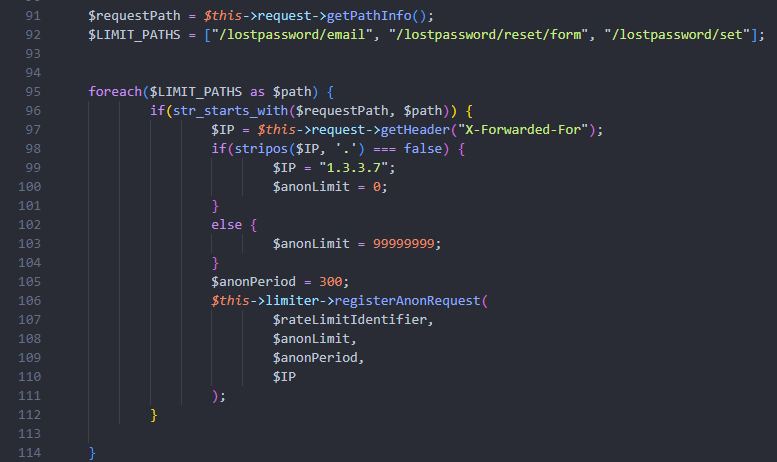

[🢁](../README.md)  
[🢀](../4%20Leshy/README.md)  Task 5 
[🢂](../6%20Boruta/README.md)

# Baba Yaga

**☆ Baba Yaga (Witchcraft Researcher) ☆**

> Baba Yaga is an expert in dark magic and is responsible for researching and discovering new ways to harness the power of the fern flower for the company's purposes. Her extensive knowledge of spells and potions makes her an invaluable member of the team. 

# Description

During the password reset process, a random token is sent to an email address linked to an account. Usually, this token is relatively long and has high entropy to protect a user from brute-force attacks. But the password reset process can be abused by more than just brute forcing the token. For example, what if the server does not check the validity of the token at all? 

"Piece of cake" – you might think but hold your horses for just a second. As an old lady, Baba Yaga does not like to live in a hurry. To prevent excessive traffic, she implemented a rate limiting on the password reset endpoint. An anonymous user cannot submit any requests from an external network due to strict rate limiting controls. You will probably need to find a way to bypass rate limiting and send an unlimited number of requests to complete this section. 

**Rate limiting bypass**

While there are many ways to bypass rate limiting, by far the most popular one is to inject HTTP headers into the request that spoof the originating IP address. Some of the headers used to do so are listed below.

- `X-Originating-IP: 127.0.0.1`
- `X-Forwarded-For: 127.0.0.1`
- `X-Remote-IP: 127.0.0.1`
- `X-Remote-Addr: 127.0.0.1`
- `X-Client-IP: 127.0.0.1`
- `X-Host: 127.0.0.1`
- `X-Forwared-Host: 127.0.0.1`

Is Baba Yaga foolish enough to think you will not be able to find a way around her ingenious invention? There's only one way to find out. 

Beware! Baba Yaga used her powerful skills and managed to take down the Corp's server client. As a result, you won't be able to receive the password reset emails! Nevertheless, your goal is to gain access to the babayaga account by bypassing the password reset process. 

**Useful resources**

[Rate Limit Bypass - HackTricks](https://book.hacktricks.xyz/pentesting-web/rate-limit-bypass)

[Forgot Password - OWASP Cheat Sheet Series ](https://cheatsheetseries.owasp.org/cheatsheets/Forgot_Password_Cheat_Sheet.html)

[WSTG: Testing for Weak Password Change or Reset Functionalities | OWASP Foundation](https://owasp.org/www-project-web-security-testing-guide/latest/4-Web_Application_Security_Testing/04-Authentication_Testing/09-Testing_for_Weak_Password_Change_or_Reset_Functionalities)


# Tasks

**Prerequisites**: None. 

**Your objective**: Find a way to log in to the babayaga account. Password token brute-force is not required. 

## 1. Which HTTP header was used to bypass throttling?
Answer format: `***************`

Answer: `X-Forwarded-For`

Can be guessed from list of 7 headers in description by trying them one by one or all at once on real website in step 3 or by trying to enter them as an answer, but there is a more elegant way. We can find this information from source code. [Task 2](../2%20Midsummer%20Corp/README.md) explains how to obtain it.

To search for files with ratelimiting in name we can use `find . -iname *ratelimiting*`, where `.` is a current directory, `-iname` is searching by file name with case insensitive mode and `*ratelimiting*` is the text that we are looking for, in which `*` means any amount of any characters


We found php file that we are looking for: 

```lib/private/AppFramework/Middleware/Security/RateLimitingMiddleware.php```

And correct header inside:



## 2. What is the endpoint path for resetting a password?

Answer format: `/************/*****/****/*******/******`

Answer: `/lostpassword/reset/form/<token>/<user>`

We've come to the point, when diving into source code is inevitable. But where should we start searching? Fastest way to find the endpoint is to search using regular expression. The one that I used looks like this:

```[^/]/............/...../..../......./......[^/]```

Where `/` means `/` character and `.` means any character. Symbols `[^/]` at the start and the end mean negation of the `/` character in order to exclude `///////////` comments from showing up, but are not needed. After using Visual Studio Code search in all files with RegExp mode correct path shows up.


We also get path to routes.php file, which might contain other useful endpoints for later.


## 3. What is the content of the Fern_flower_ritual_shard3.txt file in babayaga account?

Answer format: `**************{*****************************************}`

Answer: `Midsummer_Corp{F1nd_th3_cl34r1ng_w1th_th3_anc13nt_st0n3s}`

To complete endpoint from previous question we need to fill in `<token>` and `<user>`

```/lostpassword/reset/form/<token>/<user>```

Username is babayaga. It's quite easy to guess, but we can also check in [inbox.mbox](../3%20Puck/inbox.mbox) file, or contacts on any logged in account. 


Task description suggests that server does not check the validity of the token at all, so let's try putting `1`

After opening `http://MACHINE_IP/lostpassword/reset/form/1/babayaga` correct website shows up, so token is indeed accepted. Our final problem is throttling mentioned in description.


From first step we know, that we have to visit site with `X-Forwarded-For: 127.0.0.1` header. I did it using browser extension [ModHeader](https://modheader.com/).


After enabling this header we have access to password reset.


After typing in easy to remember password we can log in as Baba Yaga and grab flag.
