[🢁](../README.md) &nbsp;
[🢀](../5%20Baba%20Yaga/README.md) &nbsp;Task 6&nbsp;
[🢂](../7%20Twardowski/README.md)

# Boruta

**☆ Boruta (Trickster) ☆**

>Boruta is a mischievous and unpredictable figure, known for his ability to shape-shift and his love of pranks and practical jokes. As the company's Trickster, Boruta uses his skills to distract and confuse their enemies, often leading them astray with illusions and false leads. Despite his playful nature, Boruta is fiercely loyal to the company and will stop at nothing to help them achieve their goals. 


# Description

Now that you know who Boruta is, there's one more thing you need to know about him. Boruta treats the security of his account with the utmost seriousness. In fact, he doesn't even use the main password to log into his account. Instead, he's very keen on the app passwords feature and praises it every chance he gets. In his mind, app passwords greatly align with his approach to security. 

## What is a Mass Assignment vulnerability?

The vulnerability occurs when an active record pattern in a web application is misused to modify data objects that should not be altered. This could allow an attacker to escalate privileges or otherwise affect the execution flow of the program. For the former, consider modifying the class member variable named role. An attacker could simply change its value from user to admin. 

Now it's time for you to prove yourself. Can you prank the prankster? Can you stay focused on the mission and avoid Boruta's red herrings?

## Alternative ways to log in

NextCloud web application is not the only way for the user to access their files. Can you figure out a way to use an app password? There's definitely more than one!

## Useful resources 

[Mass Assignment - OWASP Cheat Sheet Series](https://cheatsheetseries.owasp.org/cheatsheets/Mass_Assignment_Cheat_Sheet.html)


# Tasks

**Prerequisites**: Access to any account. 

**Your objective**: Find a way to log in to the boruta account. 

## 1. What parameter name assigns the app password to the specific user?

Answer format: `*********`

Answer: `loginName`

To check parameter name we need to create new app password in security settings as any user.

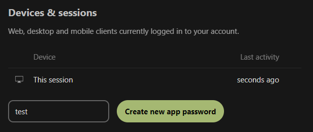

After creating app password new request is send. We can check it's response in network tab of developer tools and see what key describes username.

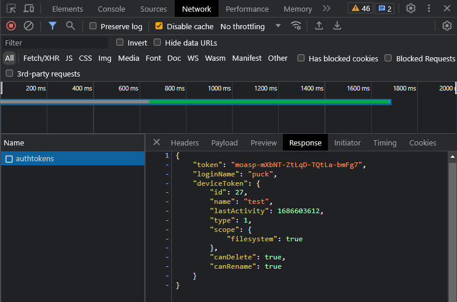


## 2. What is the content of the Fern_flower_ritual_shard4.txt file in Boruta's account?

Answer format: `**************{*********************************}`

Answer: `Midsummer_Corp{L3ave_an_0ff3r1ng_f0r_th3_spir1ts}`

Mass Assignment vulnerability given in description together with `loginName` parameter from previous step direct us to specific solution. We need to recreate request createing new app password, but for other user than is currently logged in. 

To send requests I will be using Postman. First obstacle to overcome is to access browser session in Postman. Instead of copying cookie names and values one by one I installed [Postman Interceptor browser extension](https://chrome.google.com/webstore/detail/postman-interceptor/aicmkgpgakddgnaphhhpliifpcfhicfo?hl=pl) and enabled cookie synchronization.

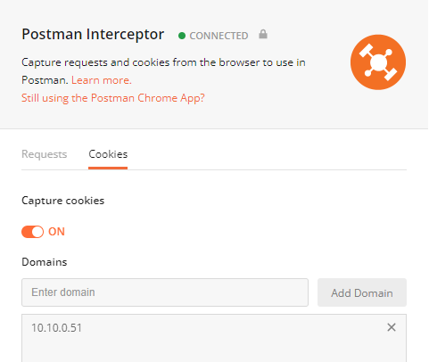

To check whether session works we can disable automatic redirect in settings

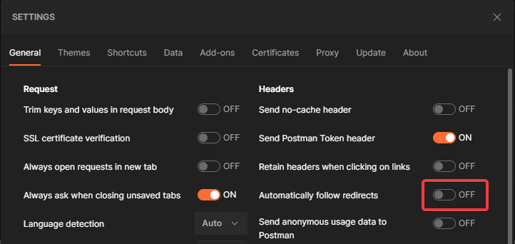

If session works we will be redirected to /apps/files

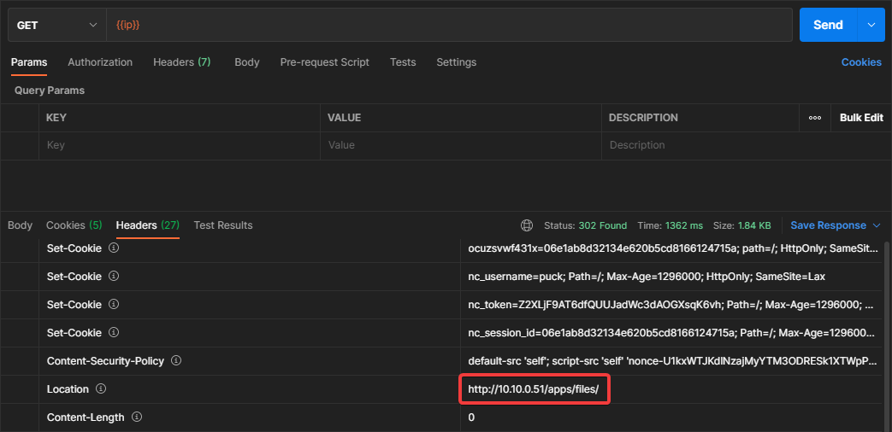

If session is not working correctly we will be redirected to /login

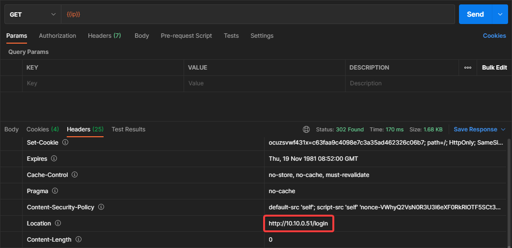

In previous request's header we can check endpoint which will accept our reqest

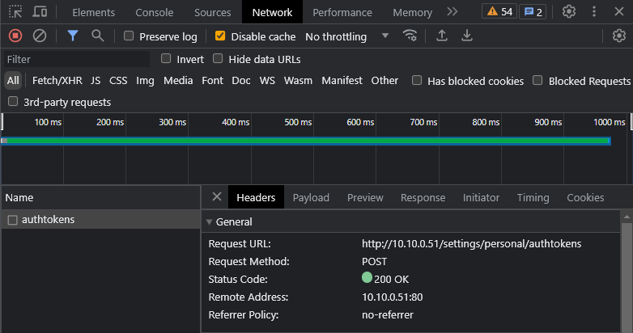

Whereas in payload tab we get to know, that under normal circumstances only name is send. 

For our covenience, we can copy cookies present in headers and paste them in `Cookie` header in Postman, to prevent losing session after some requests

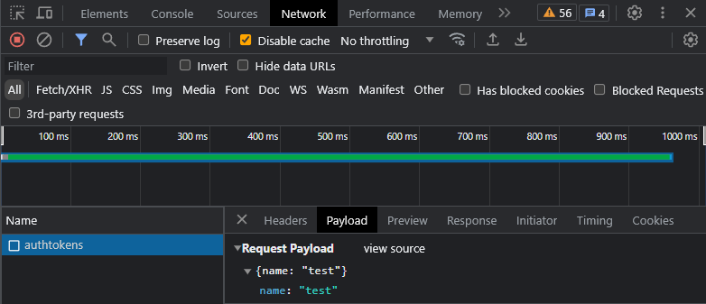


I sent POST request with boruta loginName, but in response I got message about CSRF check failed

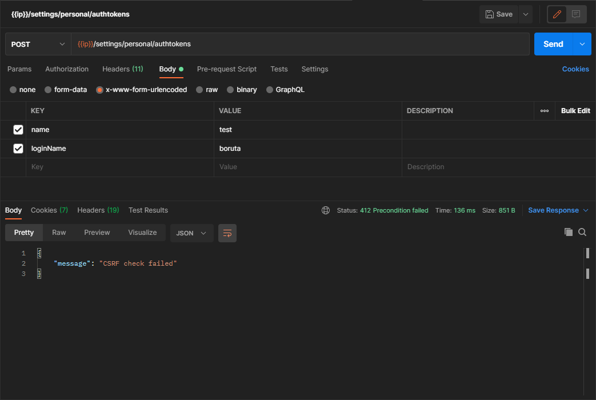

It's time to find out what is required to pass this check. Searching for exact error in code leads us to exception

```php
class CrossSiteRequestForgeryException extends SecurityException {
	public function __construct() {
		parent::__construct('CSRF check failed', Http::STATUS_PRECONDITION_FAILED);
	}
}
```

This exception is only thrown once

```php
if (!$this->request->passesCSRFCheck() && !(
    $controller instanceof OCSController && (
        $this->request->getHeader('OCS-APIREQUEST') === 'true' ||
        strpos($this->request->getHeader('Authorization'), 'Bearer ') === 0
    )
)) {
    throw new CrossSiteRequestForgeryException();
}
```

Going after `passesCSRFCheck()` function reveals solution

```php
public function passesCSRFCheck(): bool {
    if ($this->csrfTokenManager === null) {
        return false;
    }

    if (!$this->passesStrictCookieCheck()) {
        return false;
    }

    if (isset($this->items['get']['requesttoken'])) {
        $token = $this->items['get']['requesttoken'];
    } elseif (isset($this->items['post']['requesttoken'])) {
        $token = $this->items['post']['requesttoken'];
    } elseif (isset($this->items['server']['HTTP_REQUESTTOKEN'])) {
        $token = $this->items['server']['HTTP_REQUESTTOKEN'];
    } else {
        //no token found.
        return false;
    }
    $token = new CsrfToken($token);

    return $this->csrfTokenManager->isTokenValid($token);
}
```

We need to add correct `requesttoken` to request headers. We can grab it from original request.

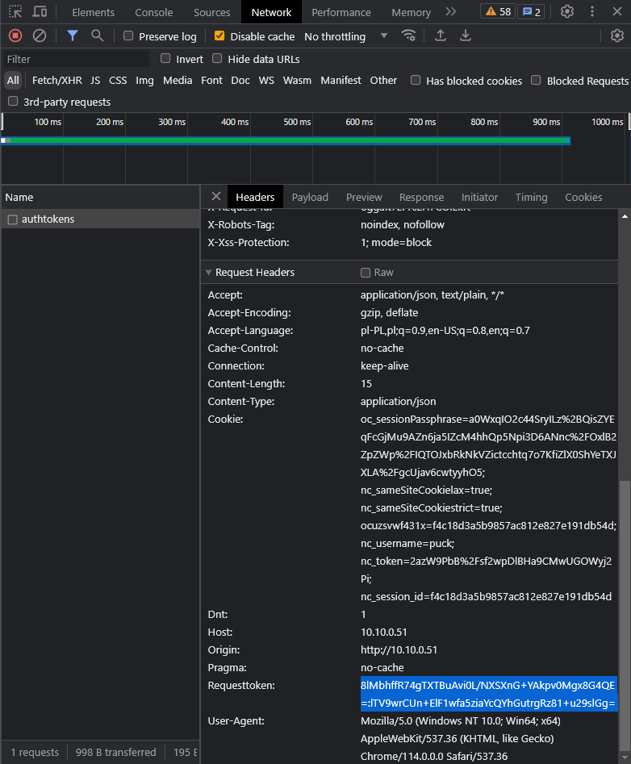

With correct token we finally get another error (yay?) about being blocked by firewall

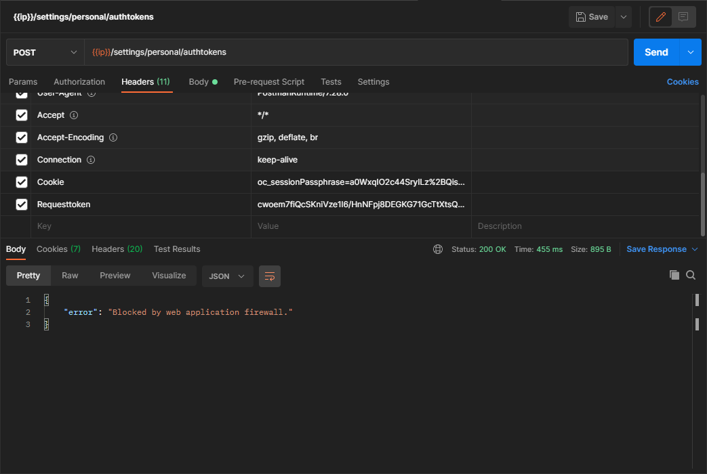

Searching for exact error in code leads us to only one place in `www\apps\settings\lib\Controller\AuthSettingsController.php`.

```php
$ALLOWED_USERS = ['boruta'];

if (in_array($loginName, $ALLOWED_USERS) && !is_null($loginName)){
    return new JSONResponse([
        'error' => "Blocked by web application firewall.",
    ]);
}

if (!in_array(rtrim($loginName), $ALLOWED_USERS) && !is_null($loginName)){
    return new JSONResponse([
        'error' => "Account ".$loginName." does not support device tokens.",
    ]);
}
```

After some analyzing we can see, that users named exactly `boruta` are denied. How can we deal with this? By slightly changing username. Second `if` contains rtrim function, which removes all whitespace characters from the right side of the string. Adding one space character after username gets rid of this problem and we get following response:

```json
{
    "token": "z76s4-M27LJ-bX99i-Q9zQq-KZbqJ",
    "loginName": "boruta",
    "deviceToken": {
        "id": 48,
        "name": "test",
        "lastActivity": 1686610159,
        "type": 1,
        "scope": {
            "filesystem": true
        },
        "canDelete": true,
        "canRename": true
    }
}
```

Token is our app password, so we only need to use client, that allows us to log in using it instead of normal password. It's also mentioned at the end of the description. Official Nextcloud desktop client allows us to do it, so obtaining flag is just a formality at this point.
