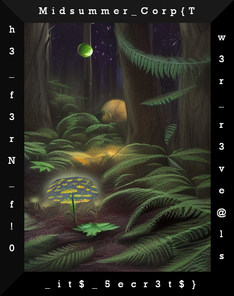

[🢁](../README.md) &nbsp;
[🢀](../8%20Popiel/README.md) &nbsp;Task 9&nbsp;
🢂

# End of the journey

As you wander through the dense forest, your eyes scan the ground for any sign of the elusive fern flower. You've been searching for hours, but your determination keeps you going. Suddenly, you spot a flash of vibrant green and silver out of the corner of your eye. Could it be there? You rush over to investigate, and there it is – the fern flower blooming in all its glory. 

As you pick it up, a sense of wonder washes over you. You marvel at the intricate patterns on the petals and the delicate fragrance that fills the air. But as you hold the flower in your hand, you realize that the true power of this moment is not in the flower itself, but in the journey that led you here. 

You think back to the challenges you faced along the way – the steep hills, the thorny brambles, the swarms of mosquitoes – and you realize that each obstacle has taught you something valuable. You have gained strength from the climb, resilience from the scratches, and patience from the bugs. 

In that moment, you feel a sense of deep gratitude for the journey and the knowledge it brought you. As you tuck the fern flower safely into your pocket, you vow to carry that wisdom with you always. 

# Tasks

## What is the flag hidden in the pieces of painting across all of Midsummer Corp employees' accounts?

Answer format: `**************{***********************************}`

Answer: `Midsummer_Corp{Th3_f3rN_f!0w3r_r3ve@ls_it%_5ecr3t$}`

On each account there is an image piece 

- [fernflower_flag1.png](./fernflower_flag1.png) from Puck
- [fernflower_flag2.png](./fernflower_flag2.png) from Leshy
- [fernflower_flag3.png](./fernflower_flag3.png) from Baba Yaga
- [fernflower_flag4.png](./fernflower_flag4.png) from Twardowski
- [fernflower_flag5.png](./fernflower_flag5.png) from Boruta
- [fernflower_flag6.png](./fernflower_flag6.png) from Popiel

Combined together they reveal last flag

