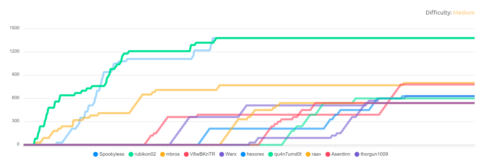

# The Midsummer Corp Hack by Securing
## Tasks

1. [Fern Flower](./1%20Fern%20Flower/README.md)
2. [Midsummer Corp](./2%20Midsummer%20Corp/README.md)
3. [Puck](./3%20Puck/README.md)
4. [Leshy](./4%20Leshy/README.md)
5. [Baba Yaga](./5%20Baba%20Yaga/README.md)
6. [Boruta](./6%20Boruta/README.md)
7. [Twardowski](./7%20Twardowski/README.md)
8. [Popiel](./8%20Popiel/README.md)
9. [End of the journey](./9%20End%20of%20the%20journey/README.md)

## Leaderboards

🥇 **1st** place (ex aequo)

https://tryhackme.com/room/midsummer

Start date: 05 June 2023, 09:00

Room by Securing:
[Website](https://www.securing.pl/) |
[Facebook](https://www.facebook.com/SecuRingPL) |
[LinkedIn](https://www.linkedin.com/company/securing/) |
[Twitter](https://twitter.com/SecuRingPL) 

## Summary

I really liked the level of difficulty and the type of tasks.

External resources included in some descriptions were very helpful in getting familiar with concepts that not everyone have to be familiar with like SAML and OAuth. In order to solve problems I had to learn how these concepts work which may come in handy when developing my own applications in the future. 

Suggestions for possible vulnerabilities found in descriptions and emails helped guide to the correct paths.

I learned a lot from this event and I am looking forward to the next edition.

## What I learned:

- I practiced looking through source code which I am completely unfamilliar with and finding what I am searching for
- I discovered new tool - [ModHeader extension](https://modheader.com/) - that allows to use custom headers when visiting websites
- I learned how rate limiting can be bypassed and what can be done to prevent it
- I learned about mass assignment vulnerability and what can be done to prevent it
- I discovered new website - [OWASP Cheet Sheet](https://cheatsheetseries.owasp.org/cheatsheets/Forgot_Password_Cheat_Sheet.html) - with thematically grouped cheat sheets pointing out easy to overlook things that can lead to vulnerabilities, such as the two mentioned above. During development of my apps I will remember to go back there and check if they apply to case.
- I learned what is SAML, and know how to craft a SAML Response, start authorization process and how Service Provider and Identity Provider communicate with each other
- I learned how OAuth works, how to initiatie flow, obtain authorization code and exchange it for access token